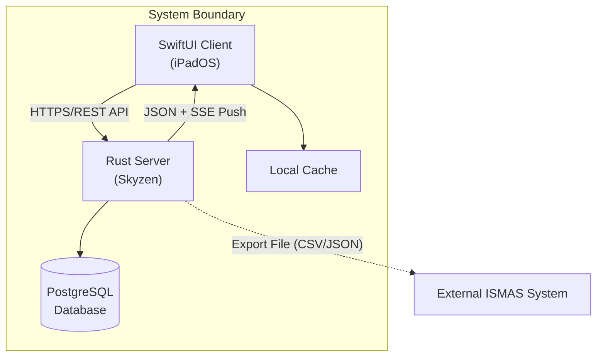
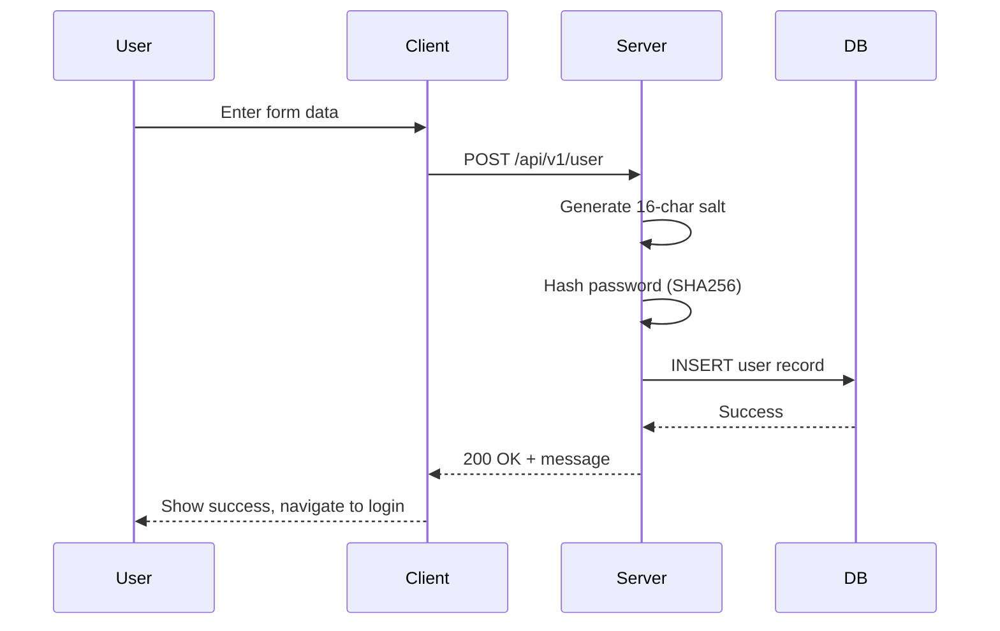
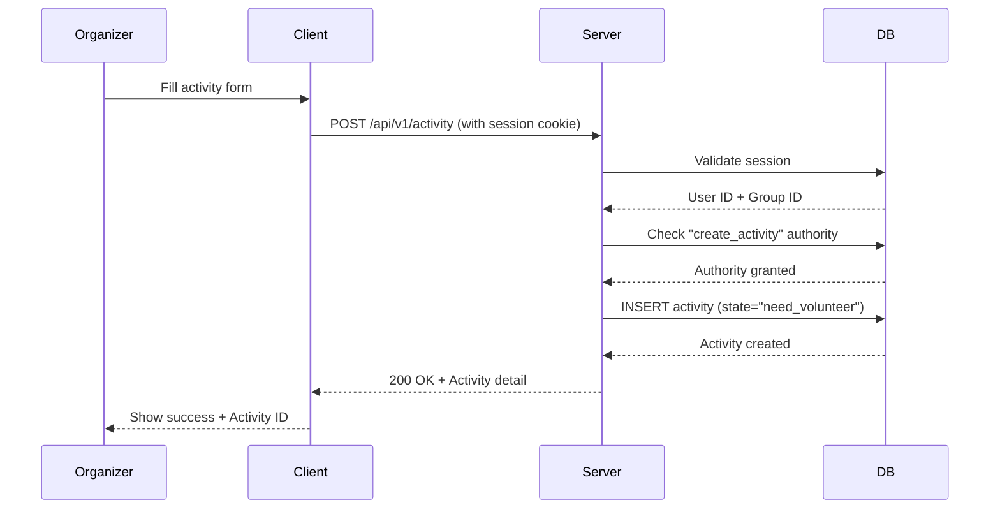
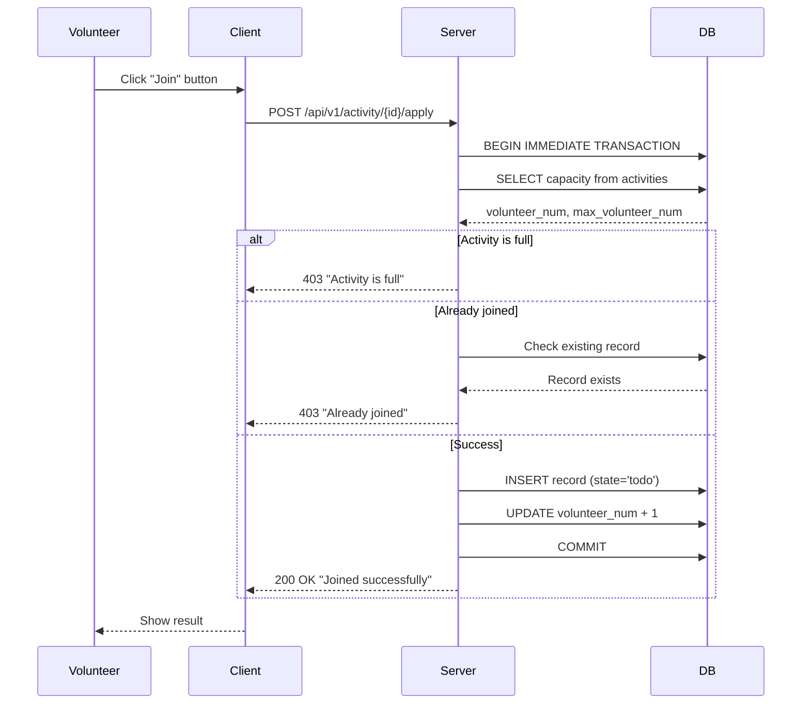
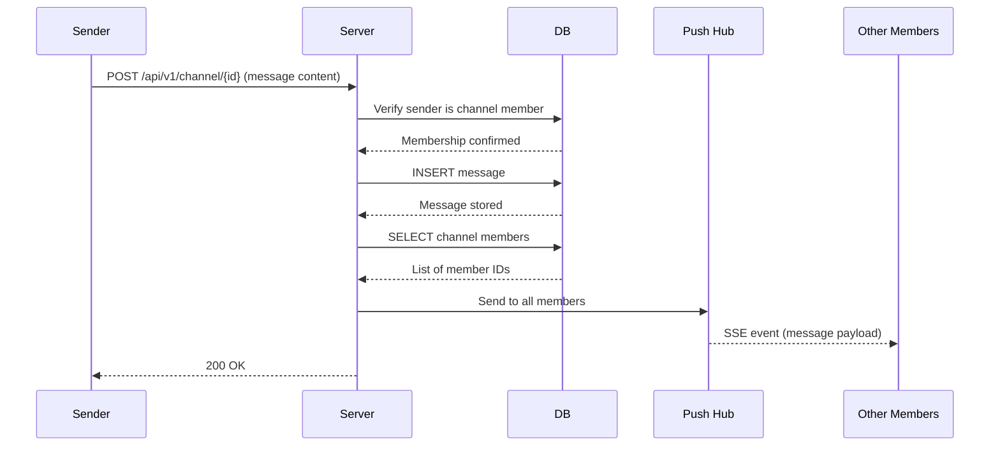
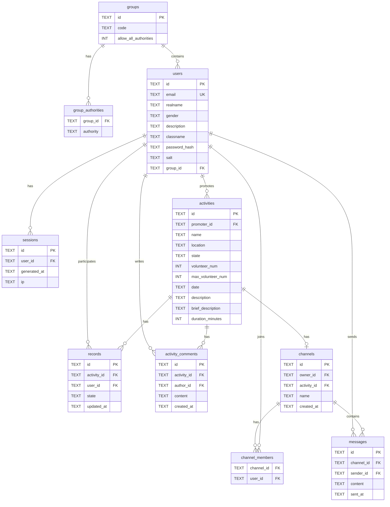
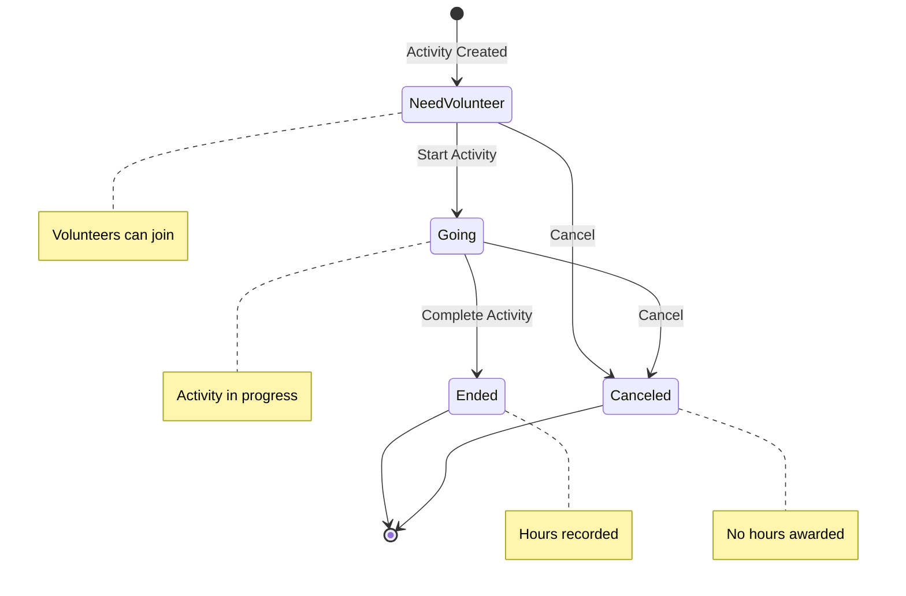
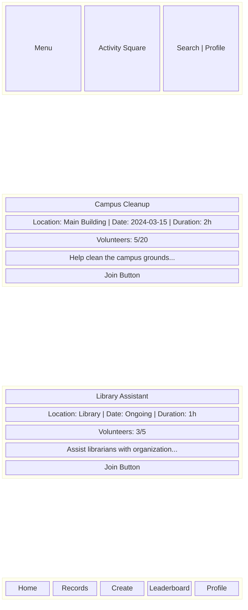

# Criterion B: Solution Overview

## 1. Record of Tasks

| Task No. | Date(s) | Phase | Task Description | Process | Deliverable | Reflection / Next Steps |
|----------|---------|-------|------------------|---------|-------------|------------------------|
| 1 | Week 1 | Plan | Initial client meeting and requirements gathering | Met with school administrator and student council to discuss current pain points. Documented fragmented workflows across DingTalk, forums, and physical posters. Identified key user roles: volunteers and organizers. | Requirements document, user personas, initial success criteria draft | Need to prioritize features. The ISMAS export requirement is critical for adoption. |
| 2 | Week 2 | Plan | Technology stack research and selection | Evaluated frameworks: compared SwiftUI vs Flutter for iOS client, Rust vs Node.js for backend, PostgreSQL vs MongoDB for database. Prioritized type safety, performance, and native iPad experience. | Technology decision document | Chose SwiftUI for native performance, Rust for memory safety, PostgreSQL for relational integrity. Need to design database schema. |
| 3 | Week 3 | Design | Database schema design | Designed entity-relationship model covering users, activities, records, channels, and messages. Identified primary/foreign key relationships. Planned for state machines in activities and records. | ERD diagram, SQL schema draft | Schema needs review for normalization. Will implement group-based permissions system. |
| 4 | Week 4 | Design | API endpoint architecture | Designed RESTful API structure with authentication middleware. Planned session-based auth with secure cookie handling. Documented all endpoints with OpenAPI specification. | API specification document, route structure | Need to implement real-time push for messages. Will use SSE instead of WebSocket for simplicity. |
| 5 | Week 5-6 | Develop | Core authentication system | Implemented user registration with SHA256 password hashing and random salt. Created session management with cookie-based authentication. Built group-authority permission system. | `auth.rs`, `login.rs`, `user.rs` modules | Testing revealed need for better error messages. Refactored error types with clear HTTP status codes. |
| 6 | Week 7-8 | Develop | Activity management module | Implemented CRUD operations for activities. Built state machine: NeedVolunteer → Going → Ended / Canceled. Added promoter authorization checks. | `activity.rs` module with full API | Activity listing was slow. Optimized with SQL indexing and selective field queries. |
| 7 | Week 9 | Develop | Volunteer record system | Implemented join activity logic with transaction-based capacity checking. Created record state management: Todo → Done / Canceled. | `record.rs` module | Found race condition in concurrent joins. Fixed with database transactions (BEGIN IMMEDIATE for SQLite). |
| 8 | Week 10 | Develop | Communication channels and messaging | Built channel creation linked to activities. Implemented message posting with membership validation. Added real-time push via Server-Sent Events. | `channel.rs`, `message.rs`, `push.rs` modules | Real-time push working but needs cleanup on disconnect. Added dead sender detection. |
| 9 | Week 11 | Develop | Comments and notifications | Implemented activity comment system. Built notification storage and delivery. Integrated push notifications for new messages. | `comment.rs`, `notification.rs` modules | Comments need pagination for large threads. Added ORDER BY created_at DESC. |
| 10 | Week 12 | Test | Unit testing implementation | Wrote unit tests for authentication, registration, record creation, and volunteer filtering. Used in-memory SQLite for isolated tests. | Test suite with 6 test functions | Tests uncovered bug in canceled state spelling variants. Added backwards compatibility parsing. |
| 11 | Week 13 | Test | Integration testing with client | Conducted end-to-end testing with SwiftUI client prototype. Verified activity creation visibility timing (<5 seconds). Tested on iPadOS 17.5. | Test results document, bug reports | Found session cookie path issue. Fixed by setting explicit path="/" on cookies. |
| 12 | Week 14 | Develop | Bug fixes and iteration | Fixed identified issues: cookie path, state spelling variants, error message clarity. Improved database connection pooling. | Updated codebase with fixes | All critical bugs resolved. Ready for user acceptance testing. |
| 13 | Week 15 | Test | User acceptance testing | Conducted testing with 5 volunteer students and 2 organizers. Measured task completion rates, collected feedback on UI. | UAT feedback document | Users found activity joining intuitive. Suggested adding leaderboard feature. |
| 14 | Week 16 | Develop | Leaderboard implementation | Designed hours aggregation query. Implemented leaderboard endpoint with ranking by total completed hours. | Leaderboard API endpoint | Query optimized with proper indexing on records table. |
| 15 | Week 17 | Implement | Production deployment preparation | Configured PostgreSQL for production. Set up database migrations. Documented deployment process. | Deployment guide, production configuration | System ready for pilot deployment at school. |

---

## 2. Design Overview

### 2.1 Solution Architecture

The system follows a **client-server architecture** with clear separation between the presentation layer (SwiftUI client) and business logic layer (Rust server).



#### Component Description

| Component | Technology | Responsibility |
|-----------|------------|----------------|
| **SwiftUI Client** | Swift/SwiftUI, iPadOS 17.5+ | User interface, local state management, API communication |
| **Rust Server** | Rust, Skyzen framework | Business logic, authentication, API endpoints, real-time push |
| **Database** | PostgreSQL (prod) / SQLite (dev) | Persistent data storage, referential integrity |
| **Push Hub** | Server-Sent Events (SSE) | Real-time message delivery to connected clients |

#### Module Structure (Server)

| Module | Path | Responsibility |
|--------|------|----------------|
| **main** | `server/src/main.rs` | Application entry, route configuration |
| **database** | `server/src/database.rs` | Database connection, SQL dialect handling |
| **auth** | `server/src/auth.rs` | Authentication middleware, session validation |
| **login** | `server/src/login.rs` | Login handler, session generation |
| **user** | `server/src/user.rs` | User CRUD operations |
| **activity** | `server/src/activity.rs` | Activity management, state transitions |
| **record** | `server/src/record.rs` | Volunteer record tracking |
| **channel** | `server/src/channel.rs` | Communication channels |
| **message** | `server/src/message.rs` | Message posting and retrieval |
| **comment** | `server/src/comment.rs` | Activity comments |
| **notification** | `server/src/notification.rs` | User notifications |
| **push** | `server/src/push.rs` | SSE push notification hub |
| **resource** | `server/src/resource.rs` | File upload/download |
| **utils** | `server/src/utils.rs` | Shared utilities (hashing, ID parsing)

---

### 2.2 Key User Flows

#### Flow 1: User Registration (Success Criterion #1)

**Trigger**: User opens app and selects "Register"



**Steps**:
1. User enters email, realname, password, gender, classname
2. Client validates input format locally
3. Client sends POST request to `/api/v1/user`
4. Server generates 16-character random salt
5. Server computes `password_hash = SHA256(password + salt)`
6. Server assigns default "student" group
7. Server inserts user record into database
8. Server returns success message
9. Client navigates to login screen

**Boundary Conditions**:
- Email must be unique (returns "User already exists" if duplicate)
- Student group must exist in database (returns 500 if missing)

---

#### Flow 2: Activity Publication (Success Criterion #2)

**Trigger**: Organizer creates new activity



**Steps**:
1. Organizer enters name, date, location, description, max volunteers, duration
2. Client sends POST with session cookie
3. Server validates session, extracts user ID
4. Server checks `create_activity` authority for user's group
5. Server inserts activity with state = "need_volunteer"
6. Server returns created activity detail with ID
7. Activity immediately visible in volunteer listing

**Data Written**:
- `id`: New UUID
- `promoter_id`: Authenticated user's ID
- `state`: "need_volunteer"
- `volunteer_num`: 0

---

#### Flow 3: Volunteer Joining Activity (Success Criterion #3)

**Trigger**: Volunteer clicks "Join" on activity



**Critical Logic** (Transaction-based):
```
BEGIN IMMEDIATE TRANSACTION
  1. SELECT volunteer_num, max_volunteer_num FROM activities WHERE id = ?
  2. IF volunteer_num >= max_volunteer_num: ROLLBACK, return "Full"
  3. SELECT 1 FROM records WHERE activity_id = ? AND user_id = ?
  4. IF exists: ROLLBACK, return "Already joined"
  5. INSERT INTO records (id, activity_id, user_id, state) VALUES (?, ?, ?, 'todo')
  6. UPDATE activities SET volunteer_num = volunteer_num + 1 WHERE id = ?
COMMIT
```

**Boundary Conditions**:
- Activity must exist (404 if not found)
- Activity must not be full (403 if at capacity)
- User must not have already joined (403 if duplicate)

---

#### Flow 4: Real-time Messaging (Success Criterion #4)

**Trigger**: Participant sends message in activity channel



**Push Mechanism**:
- Clients connect to `/api/v1/push` endpoint (SSE)
- Server maintains HashMap of user ID → active SSE senders
- On message post, server looks up all channel members
- Sends JSON payload to each connected member via SSE

---

### 2.3 Data Design

#### Entity-Relationship Diagram



#### Table Specifications

| Table | Field | Type | Constraints | Description |
|-------|-------|------|-------------|-------------|
| **users** | id | TEXT | PRIMARY KEY | UUID v4 as hex string |
| | email | TEXT | NOT NULL, UNIQUE | Login credential |
| | realname | TEXT | NOT NULL | Display name |
| | gender | TEXT | NOT NULL | "male"/"female"/"other" |
| | description | TEXT | NOT NULL | User bio |
| | classname | TEXT | NOT NULL | School class |
| | password_hash | TEXT | NOT NULL | SHA256(password + salt) |
| | salt | TEXT | NOT NULL | 16-char random string |
| | group_id | TEXT | NOT NULL, FK | References groups.id |
| **activities** | id | TEXT | PRIMARY KEY | UUID v4 |
| | promoter_id | TEXT | NOT NULL, FK | References users.id |
| | name | TEXT | NOT NULL | Activity title |
| | location | TEXT | NOT NULL | Venue |
| | state | TEXT | NOT NULL | "need_volunteer"/"going"/"ended"/"canceled" |
| | volunteer_num | INTEGER | NOT NULL, DEFAULT 0 | Current volunteer count |
| | max_volunteer_num | INTEGER | NULLABLE | Capacity limit (NULL = unlimited) |
| | date | TEXT | NULLABLE | Scheduled date |
| | description | TEXT | NOT NULL | Full description |
| | brief_description | TEXT | NOT NULL | Summary for listing |
| | duration_minutes | INTEGER | NOT NULL | Duration in minutes |
| **records** | id | TEXT | PRIMARY KEY | UUID v4 |
| | activity_id | TEXT | NOT NULL, FK | References activities.id |
| | user_id | TEXT | NOT NULL, FK | References users.id |
| | state | TEXT | NOT NULL | "todo"/"done"/"canceled" |
| | updated_at | TEXT | NOT NULL | ISO 8601 timestamp |

#### Data Constraints

1. **Email Uniqueness**: Enforced at database level with UNIQUE constraint
2. **Password Security**: Never stored in plaintext; salt is per-user random
3. **Volunteer Capacity**: Enforced via transaction with check before insert
4. **State Validity**: Enum-like validation in application layer with `from_db()` parser

---

### 2.4 Algorithmic / Logic Design

#### Algorithm 1: Password Hashing

**Purpose**: Secure storage of user credentials

**Input**: `password: String`, `salt: String`
**Output**: `hash: String` (64-character hex)

```pseudocode
FUNCTION hash_password(password, salt):
    combined = password + salt
    hash_bytes = SHA256(combined)
    RETURN hex_encode(hash_bytes)

FUNCTION verify_password(input_password, stored_hash, stored_salt):
    computed_hash = hash_password(input_password, stored_salt)
    RETURN computed_hash == stored_hash
```

**Security Consideration**: Each user has unique random salt, preventing rainbow table attacks.

---

#### Algorithm 2: Activity State Machine

**Purpose**: Control valid state transitions for activities

**States**: `NeedVolunteer`, `Going`, `Ended`, `Canceled`



**Transition Rules**:
```pseudocode
FUNCTION can_transition(current_state, target_state):
    IF current_state == NeedVolunteer:
        RETURN target_state IN {Going, Canceled}
    ELSE IF current_state == Going:
        RETURN target_state IN {Ended, Canceled}
    ELSE:
        RETURN FALSE  // Terminal states cannot transition
```

---

#### Algorithm 3: Concurrent Join Protection

**Purpose**: Prevent race conditions when multiple volunteers join simultaneously

**Problem**: Without protection, two users might both pass the capacity check and both join, exceeding the limit.

**Solution**: Database transaction with exclusive lock

```pseudocode
FUNCTION join_activity(user_id, activity_id):
    BEGIN IMMEDIATE TRANSACTION  // Acquires exclusive lock on SQLite

    activity = SELECT volunteer_num, max_volunteer_num
               FROM activities WHERE id = activity_id

    IF activity IS NULL:
        ROLLBACK
        RETURN Error("Activity not found")

    IF max_volunteer_num IS NOT NULL AND volunteer_num >= max_volunteer_num:
        ROLLBACK
        RETURN Error("Activity is full")

    existing = SELECT 1 FROM records
               WHERE activity_id = activity_id AND user_id = user_id

    IF existing IS NOT NULL:
        ROLLBACK
        RETURN Error("Already joined")

    INSERT INTO records (id, activity_id, user_id, state, updated_at)
        VALUES (new_uuid(), activity_id, user_id, 'todo', now())

    UPDATE activities SET volunteer_num = volunteer_num + 1
        WHERE id = activity_id

    COMMIT
    RETURN Success("Joined successfully")
```

**Time Complexity**: O(1) for all database operations (assuming indexed lookups)

---

#### Algorithm 4: Real-time Push Distribution

**Purpose**: Deliver messages to all channel members in real-time

**Data Structure**: `HashMap<UserId, Vec<SSE_Sender>>`

```pseudocode
CLASS PushHub:
    senders: RwLock<HashMap<UserId, Vec<Sender>>>

    FUNCTION subscribe(user_id):
        (sender, sse_stream) = create_sse_channel()
        WITH senders.write_lock():
            senders[user_id].append(sender)
        RETURN sse_stream

    FUNCTION send_to_user(user_id, event_type, payload):
        json_data = serialize_json(payload)

        // Extract and reset sender list
        WITH senders.write_lock():
            user_senders = senders[user_id]
            senders[user_id] = []

        alive_senders = []
        FOR sender IN user_senders:
            event = SSE_Event(data=json_data, event=event_type)
            IF sender.send(event).is_ok():
                alive_senders.append(sender)
            // Dead senders are discarded

        // Return alive senders
        WITH senders.write_lock():
            senders[user_id].extend(alive_senders)
```

**Key Design Choice**: Dead sender detection via send failure, automatic cleanup.

---

#### Algorithm 5: Leaderboard Ranking (Success Criterion #5)

**Purpose**: Rank volunteers by total completed volunteer hours

```pseudocode
FUNCTION get_leaderboard(limit):
    RETURN SQL:
        SELECT
            users.id,
            users.realname,
            SUM(activities.duration_minutes) as total_minutes
        FROM records
        JOIN activities ON records.activity_id = activities.id
        JOIN users ON records.user_id = users.id
        WHERE records.state = 'done'
        GROUP BY users.id
        ORDER BY total_minutes DESC
        LIMIT limit
```

**Index Recommendation**:
- `records(state)` for filtering done records
- `records(user_id)` for grouping

---

### 2.5 UI/UX Design

#### Screen Overview

| Screen | Primary User | Key Actions |
|--------|--------------|-------------|
| Login | All | Enter credentials, navigate to register |
| Register | New users | Enter profile information |
| Activity Square | Volunteers | Browse activities, filter, join |
| Activity Detail | All | View details, join, comment |
| My Records | Volunteers | View joined activities, status |
| Create Activity | Organizers | Enter activity details, publish |
| Manage Activity | Organizers | Edit, change state, view volunteers |
| Channel | Participants | Send/receive messages |
| Leaderboard | All | View rankings |

#### Wireframe: Activity Square



**Activity Card Components:**
- **Header**: Activity name with category icon
- **Metadata Row**: Location, date, duration (horizontal layout)
- **Capacity Indicator**: Progress bar showing current/max volunteers
- **Description**: 2-line truncated preview
- **Action Button**: Primary "Join" CTA, disabled when full

#### Input Validation

| Field | Validation Rule | Error Message |
|-------|-----------------|---------------|
| Email | Valid email format, unique | "Invalid email format" / "Email already registered" |
| Password | Minimum 6 characters | "Password must be at least 6 characters" |
| Activity Name | 1-100 characters, required | "Activity name is required" |
| Max Volunteers | Positive integer or empty | "Must be a positive number" |
| Duration | Positive integer, required | "Duration is required" |

#### Error Handling UX

- **Network Errors**: Show retry button with "Unable to connect. Tap to retry."
- **Session Expired**: Redirect to login with "Your session has expired. Please log in again."
- **Validation Errors**: Highlight field with red border, show message below field
- **Server Errors**: Show generic "Something went wrong. Please try again later."

---

## 3. Outline Test Plan

### Test Case Mapping to Success Criteria

| Test ID | Success Criterion | Test Purpose |
|---------|------------------|--------------|
| T1.1-T1.3 | #1 Account Registration | Verify user creation and data storage |
| T2.1-T2.3 | #2 Task Publication | Verify activity creation and visibility timing |
| T3.1-T3.3 | #3 Task Management | Verify edit and cancel functionality |
| T4.1-T4.3 | #4 Communication | Verify channel messaging and storage |
| T5.1-T5.2 | #5 Leaderboard | Verify ranking accuracy and updates |
| T6.1-T6.3 | #6 Hour Tracking | Verify automatic recording and export |
| T7.1-T7.2 | #7 Platform Compatibility | Verify iPadOS 17.5+ operation |

---

### Detailed Test Cases

#### T1.1: Successful User Registration

| Field | Value |
|-------|-------|
| **Success Criterion** | #1: A volunteer can create an account using their student information and avatar, and this data is stored securely in the database. |
| **Test Purpose** | Verify that a new user can register with valid information and the data is correctly stored. |
| **Preconditions** | - App is installed on iPadOS device<br>- "student" group exists in database<br>- Email "newuser@ulink.edu.cn" is not registered |
| **Test Data** | email: "newuser@ulink.edu.cn"<br>realname: "Zhang Wei"<br>password: "Test123!"<br>gender: "male"<br>classname: "G11-A" |
| **Steps** | 1. Open app, tap "Register"<br>2. Enter all test data fields<br>3. Tap "Submit"<br>4. Query database for new user record |
| **Expected Result** | - Success message displayed<br>- User record exists in `users` table<br>- Password is hashed (not plaintext)<br>- Salt is 16 characters<br>- group_id matches "student" group |
| **Actual Result** | (To be completed during testing) |
| **Pass/Fail Criteria** | PASS if all expected results are met |

---

#### T1.2: Registration with Duplicate Email

| Field | Value |
|-------|-------|
| **Success Criterion** | #1 |
| **Test Purpose** | Verify that duplicate email registration is rejected. |
| **Preconditions** | User "existing@ulink.edu.cn" already exists in database |
| **Test Data** | email: "existing@ulink.edu.cn"<br>realname: "Li Ming"<br>password: "Test456!"<br>gender: "female"<br>classname: "G10-B" |
| **Steps** | 1. Open app, tap "Register"<br>2. Enter test data with existing email<br>3. Tap "Submit" |
| **Expected Result** | - Error message "User already exists" displayed<br>- No new record created in database |
| **Actual Result** | |
| **Pass/Fail Criteria** | PASS if registration is rejected with appropriate error |

---

#### T1.3: Registration Input Validation

| Field | Value |
|-------|-------|
| **Success Criterion** | #1 |
| **Test Purpose** | Verify client-side validation of registration form. |
| **Preconditions** | App is at registration screen |
| **Test Data** | email: "invalid-email"<br>password: "123" (too short) |
| **Steps** | 1. Enter invalid email format<br>2. Enter password shorter than 6 characters<br>3. Attempt to submit |
| **Expected Result** | - Email field shows "Invalid email format" error<br>- Password field shows "Password must be at least 6 characters"<br>- Submit button disabled or submission prevented |
| **Actual Result** | |
| **Pass/Fail Criteria** | PASS if validation errors are shown before submission |

---

#### T2.1: Successful Activity Publication

| Field | Value |
|-------|-------|
| **Success Criterion** | #2: An organiser can publish a volunteer activity including attributes such as time, maximum participants, description, and duration, and it becomes visible to volunteers within five seconds. |
| **Test Purpose** | Verify activity creation and immediate visibility. |
| **Preconditions** | - User logged in as organizer (has "create_activity" authority)<br>- Volunteer device logged in with different account |
| **Test Data** | name: "Test Activity"<br>date: "2024-04-01"<br>location: "Room 101"<br>max_volunteer_num: 10<br>description: "Test description"<br>duration: 60 |
| **Steps** | 1. Organizer: Create activity with test data<br>2. Start timer when "Submit" tapped<br>3. Volunteer: Refresh activity list<br>4. Stop timer when activity appears<br>5. Verify all data matches |
| **Expected Result** | - Activity created successfully<br>- Visibility time < 5 seconds<br>- All attributes displayed correctly<br>- State is "need_volunteer"<br>- Volunteer count is 0 |
| **Actual Result** | |
| **Pass/Fail Criteria** | PASS if activity visible within 5 seconds with correct data |

---

#### T2.2: Activity Publication without Authority

| Field | Value |
|-------|-------|
| **Success Criterion** | #2 |
| **Test Purpose** | Verify that users without organizer authority cannot create activities. |
| **Preconditions** | User logged in as regular volunteer (student group without "create_activity" authority) |
| **Test Data** | Any valid activity data |
| **Steps** | 1. Attempt to access "Create Activity" screen or API |
| **Expected Result** | - "Forbidden" error returned<br>- No activity created |
| **Actual Result** | |
| **Pass/Fail Criteria** | PASS if creation is blocked |

---

#### T3.1: Activity State Change

| Field | Value |
|-------|-------|
| **Success Criterion** | #3: An organiser can edit or cancel an existing activity, and the changes are reflected immediately to all volunteers. |
| **Test Purpose** | Verify activity state can be changed and updates propagate. |
| **Preconditions** | - Activity exists in "need_volunteer" state<br>- Organizer is logged in as promoter of the activity |
| **Test Data** | Activity ID from precondition |
| **Steps** | 1. Organizer: Change state to "going"<br>2. Volunteer: Refresh activity detail<br>3. Verify state changed |
| **Expected Result** | - State updated to "going"<br>- Volunteer sees updated state immediately<br>- Activity no longer appears in "recruiting" filter |
| **Actual Result** | |
| **Pass/Fail Criteria** | PASS if state change is immediate and visible |

---

#### T3.2: Activity Cancellation

| Field | Value |
|-------|-------|
| **Success Criterion** | #3 |
| **Test Purpose** | Verify activity cancellation updates records. |
| **Preconditions** | - Activity exists with 3 joined volunteers<br>- Organizer logged in |
| **Steps** | 1. Organizer: Change activity state to "canceled"<br>2. Verify activity state in database<br>3. Volunteer: Check "My Records" |
| **Expected Result** | - Activity state is "canceled"<br>- Activity hidden from active listings<br>- Volunteer records remain for history |
| **Actual Result** | |
| **Pass/Fail Criteria** | PASS if cancellation completes and records preserved |

---

#### T4.1: Message Posting and Storage

| Field | Value |
|-------|-------|
| **Success Criterion** | #4: Participants can exchange messages within a channel associated with each activity, and these messages are stored in the system for future reference. |
| **Test Purpose** | Verify message posting and persistence. |
| **Preconditions** | - Channel exists for activity<br>- User is member of channel |
| **Test Data** | content: "Hello, this is a test message!" |
| **Steps** | 1. Post message to channel<br>2. Query database for message<br>3. Close app and reopen<br>4. Navigate to channel |
| **Expected Result** | - Message appears in channel immediately<br>- Message exists in `messages` table<br>- Message persists after app restart |
| **Actual Result** | |
| **Pass/Fail Criteria** | PASS if message stored and retrievable |

---

#### T4.2: Real-time Message Push

| Field | Value |
|-------|-------|
| **Success Criterion** | #4 |
| **Test Purpose** | Verify real-time message delivery via SSE. |
| **Preconditions** | - Two users in same channel<br>- Both connected to SSE push endpoint |
| **Test Data** | content: "Real-time test message" |
| **Steps** | 1. User A: Post message<br>2. User B: Observe message arrival (without refresh) |
| **Expected Result** | - User B receives message without manual refresh<br>- Message arrives within 2 seconds |
| **Actual Result** | |
| **Pass/Fail Criteria** | PASS if message received in real-time |

---

#### T5.1: Leaderboard Accuracy

| Field | Value |
|-------|-------|
| **Success Criterion** | #5: A leaderboard displays volunteers ranked by total recorded hours, updating automatically after each activity is completed. |
| **Test Purpose** | Verify leaderboard calculates and ranks correctly. |
| **Preconditions** | - User A has 5 hours (300 min) of completed activities<br>- User B has 3 hours (180 min)<br>- User C has 7 hours (420 min) |
| **Steps** | 1. View leaderboard<br>2. Verify ranking order |
| **Expected Result** | - Order: User C (7h), User A (5h), User B (3h)<br>- Hours displayed correctly |
| **Actual Result** | |
| **Pass/Fail Criteria** | PASS if ranking order and hours are correct |

---

#### T5.2: Leaderboard Auto-Update

| Field | Value |
|-------|-------|
| **Success Criterion** | #5 |
| **Test Purpose** | Verify leaderboard updates after activity completion. |
| **Preconditions** | - User has 2 hours on leaderboard<br>- User has record in "todo" state for 3-hour activity |
| **Steps** | 1. View leaderboard, note user's hours (2h)<br>2. Organizer marks user's record as "done"<br>3. Refresh leaderboard |
| **Expected Result** | - User's hours update to 5 hours<br>- Ranking position may change accordingly |
| **Actual Result** | |
| **Pass/Fail Criteria** | PASS if hours updated after marking done |

---

#### T6.1: Automatic Hour Recording

| Field | Value |
|-------|-------|
| **Success Criterion** | #6: The system records volunteer hours automatically after an activity is confirmed by the organiser, and it generates an export file in a format directly compatible with ISMAS. |
| **Test Purpose** | Verify hours are recorded when activity confirmed. |
| **Preconditions** | - Activity with 2-hour duration exists<br>- Volunteer has joined (record in "todo" state) |
| **Steps** | 1. Organizer marks volunteer's record as "done"<br>2. Query database for record state and timestamp |
| **Expected Result** | - Record state changed to "done"<br>- updated_at timestamp recorded<br>- Activity duration (2 hours) associated with user |
| **Actual Result** | |
| **Pass/Fail Criteria** | PASS if state changed and hours tracked |

---

#### T6.2: ISMAS Export Format

| Field | Value |
|-------|-------|
| **Success Criterion** | #6 |
| **Test Purpose** | Verify export file is compatible with ISMAS. |
| **Preconditions** | - Multiple completed records exist in database |
| **Steps** | 1. Generate export file<br>2. Verify file format matches ISMAS specification<br>3. Attempt import into ISMAS test environment |
| **Expected Result** | - Export file generated successfully<br>- Format matches required specification<br>- ISMAS accepts the import |
| **Actual Result** | |
| **Pass/Fail Criteria** | PASS if ISMAS accepts the exported file |

---

#### T7.1: iPadOS Compatibility

| Field | Value |
|-------|-------|
| **Success Criterion** | #7: The client application runs without error on iPadOS 17.5 or later, and all primary features function as intended. |
| **Test Purpose** | Verify app runs on target platform. |
| **Preconditions** | - iPad with iPadOS 17.5+ installed<br>- App installed from TestFlight or development build |
| **Steps** | 1. Launch app<br>2. Complete registration flow<br>3. Browse activities<br>4. Join an activity<br>5. Send a message<br>6. View leaderboard |
| **Expected Result** | - App launches without crash<br>- All screens render correctly<br>- All features functional |
| **Actual Result** | |
| **Pass/Fail Criteria** | PASS if all features work on iPadOS 17.5+ |

---

#### T7.2: UI Responsiveness

| Field | Value |
|-------|-------|
| **Success Criterion** | #7 |
| **Test Purpose** | Verify UI responds appropriately to iPad form factor. |
| **Preconditions** | App installed on iPad |
| **Steps** | 1. Test in portrait orientation<br>2. Test in landscape orientation<br>3. Test with keyboard visible |
| **Expected Result** | - UI adapts to both orientations<br>- No text truncation or overflow<br>- Keyboard does not obscure input fields |
| **Actual Result** | |
| **Pass/Fail Criteria** | PASS if UI adapts correctly |

---

### Test Coverage Summary

| Category | Test IDs | Coverage |
|----------|----------|----------|
| Functional - Core | T1.1, T2.1, T3.1, T4.1, T5.1, T6.1 | All success criteria |
| Boundary/Error | T1.2, T1.3, T2.2 | Input validation, authorization |
| Data Integrity | T4.1, T6.1 | Persistence verification |
| Real-time | T4.2, T5.2 | Push notifications, auto-updates |
| Compatibility | T7.1, T7.2 | Platform and UI testing |

---

## Appendix: API Reference

| Endpoint | Method | Purpose | Auth Required |
|----------|--------|---------|---------------|
| `/api/v1/user` | POST | Register new user | No |
| `/api/v1/user/{id}` | GET | Get user info | Yes |
| `/api/v1/user/{id}` | DELETE | Delete user | Yes (authority) |
| `/api/v1/login` | POST | Login, create session | No |
| `/api/v1/activity` | GET | List activities | Yes |
| `/api/v1/activity` | POST | Create activity | Yes (authority) |
| `/api/v1/activity/{id}` | GET | Get activity detail | Yes |
| `/api/v1/activity/{id}` | DELETE | Delete activity | Yes (owner/authority) |
| `/api/v1/activity/{id}/apply` | POST | Join activity | Yes |
| `/api/v1/activity/{id}/go` | POST | Set state to Going | Yes |
| `/api/v1/activity/{id}/end` | POST | Set state to Ended | Yes |
| `/api/v1/activity/{id}/cancel` | POST | Cancel activity | Yes |
| `/api/v1/activity/{id}/comment` | GET | List comments | Yes |
| `/api/v1/activity/{id}/comment` | POST | Post comment | Yes (authority) |
| `/api/v1/record` | GET | Find records | Yes |
| `/api/v1/record/{id}/done` | POST | Mark record done | Yes (owner) |
| `/api/v1/channel` | GET | Find channels | Yes |
| `/api/v1/channel` | POST | Create channel | Yes (authority) |
| `/api/v1/channel/{id}` | DELETE | Delete channel | Yes (owner/authority) |
| `/api/v1/channel/{id}` | POST | Post message | Yes (member) |
| `/api/v1/message` | GET | Find messages | Yes |
| `/api/v1/push` | GET | SSE push subscription | Yes |
