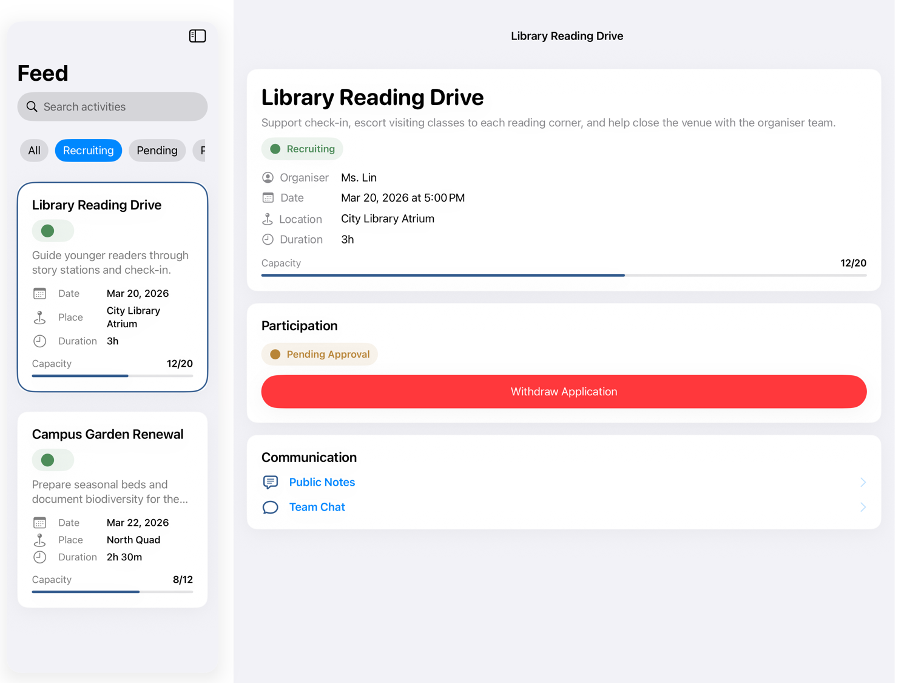
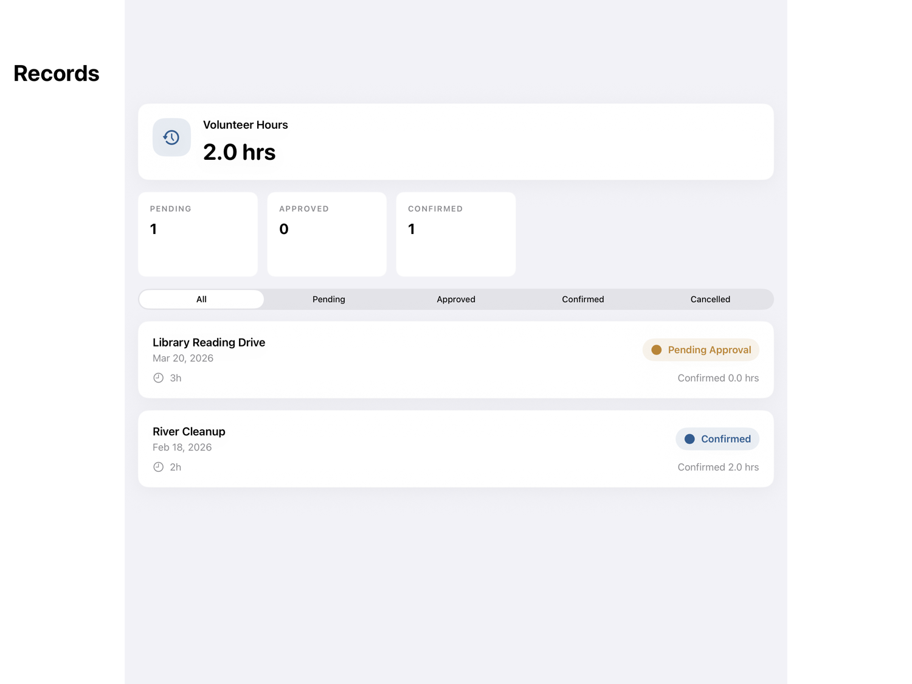
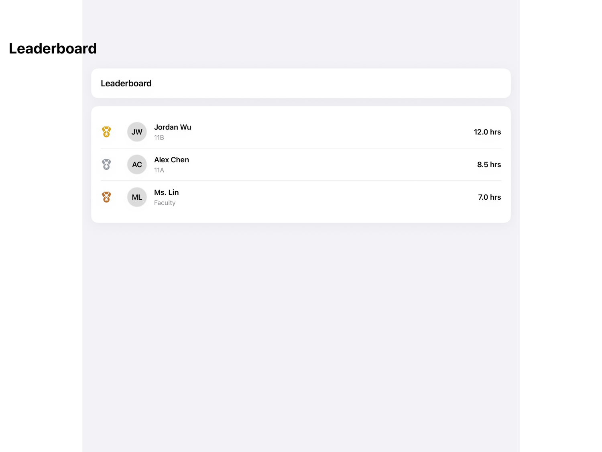
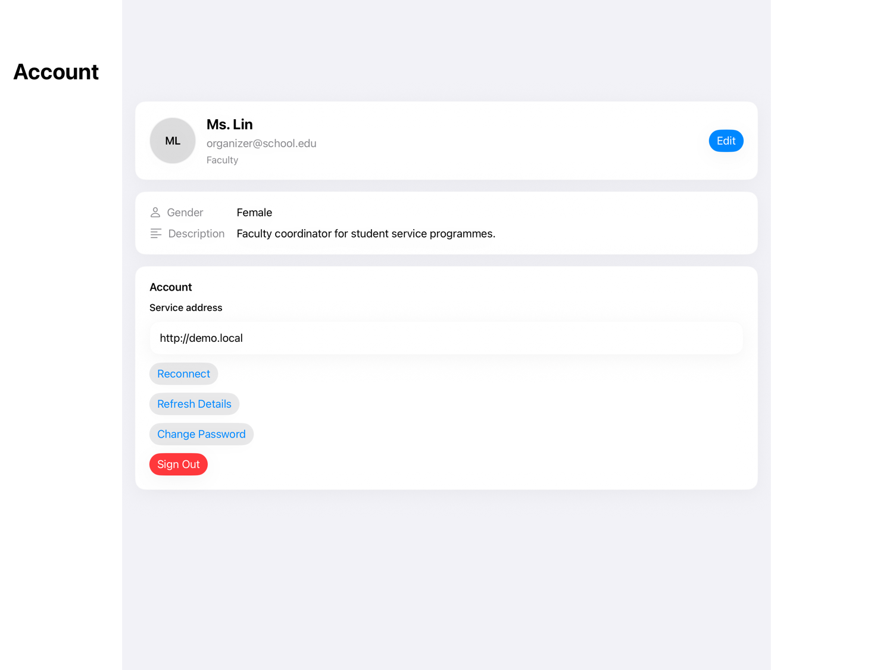
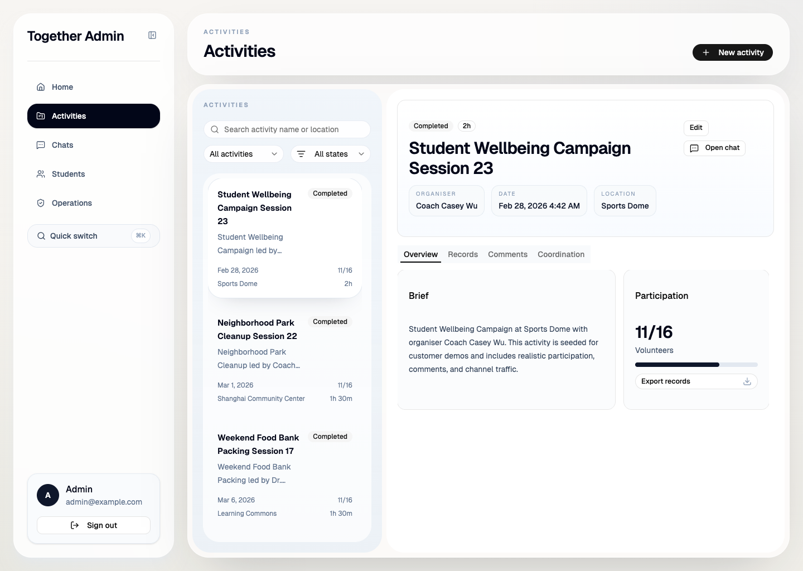
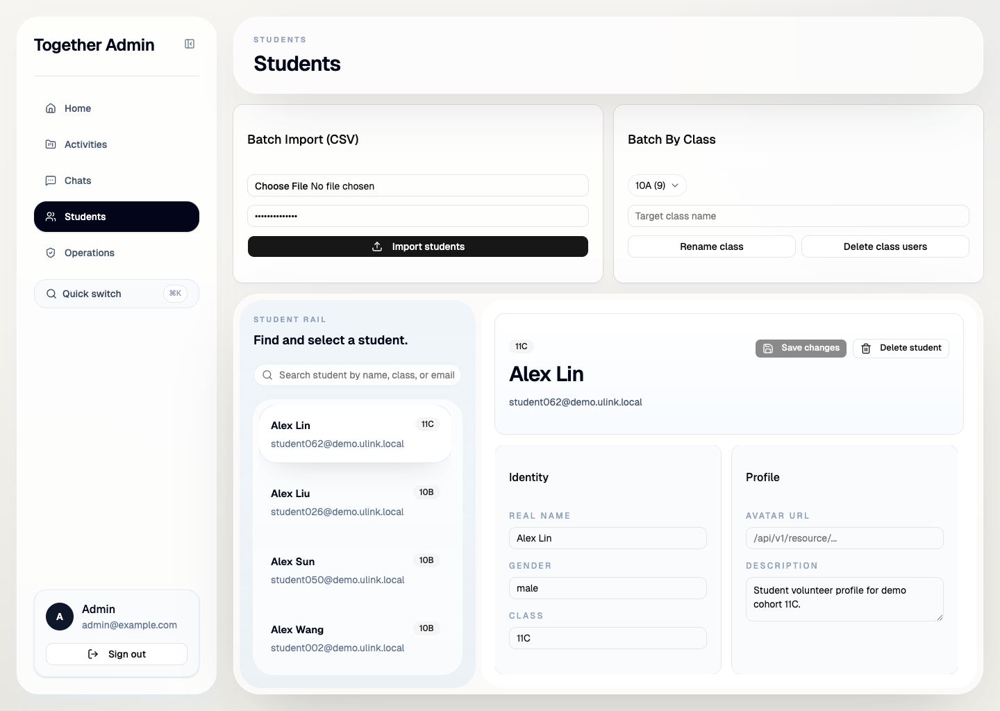
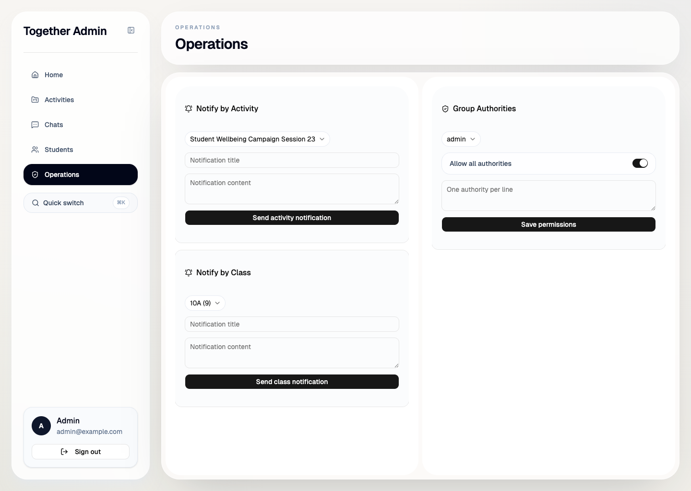
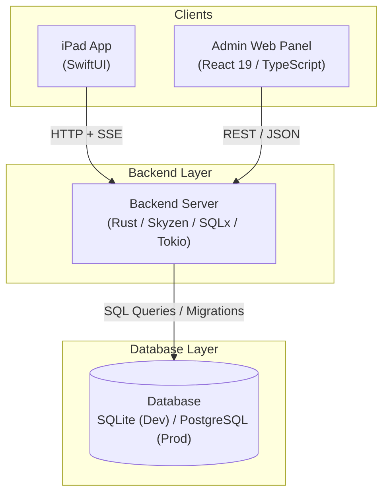

# ULink Together

Volunteer management system built for Ulink College of Shanghai. Students browse and join volunteer activities from school-managed iPads; teachers publish activities, confirm hours, and export records from a web panel. Written as an IB Computer Science IA project.

## Student iPad app (SwiftUI)



The iPad UI is landscape-only with a persistent split view. Activities list on the left, detail on the right. Students can filter by status, join activities, track their hours, and message within activity channels.

Other screens:

| Records | Leaderboard | Account |
|:---:|:---:|:---:|
|  |  |  |

## Admin web panel (React + Tailwind)

| Activities | Students | Operations |
|:---:|:---:|:---:|
|  |  |  |

The admin panel gives teachers a sidebar-driven workspace. They can search and filter activities, drill into participation records and export them, batch-import students from CSV, edit individual profiles, and send push notifications scoped by activity or class. Organiser permissions are managed through a group authority system rather than fixed roles.

## Architecture



The backend is built on [Skyzen](https://github.com/zen-rs/skyzen) (a Rust HTTP framework) with SQLx for database access. Auth is cookie-based. Real-time updates go over SSE at `/api/v1/push`. Organiser permissions use an authority model rather than hard-coded roles.

## Tech stack

| Layer | Stack |
|-------|-------|
| iPad client | SwiftUI, iPadOS 17.5+, landscape-locked |
| Admin panel | React 19, TypeScript, Tailwind CSS 4, Vite, TanStack Query |
| Backend | Rust, Skyzen, SQLx, Tokio |
| Database | SQLite (dev) / PostgreSQL (prod) |
| API docs | utoipa (OpenAPI) |

## Running locally

### Prerequisites

- Rust stable toolchain
- Bun
- Xcode

### 1. Backend

```bash
# create the database and seed an admin account
touch together.db
cargo run -p together-server --bin deploy -- \
  --database-url sqlite://./together.db \
  --admin-email admin@example.com \
  --admin-password changeme \
  --admin-realname "Admin" \
  --admin-gender unspecified \
  --admin-classname Admin \
  --non-interactive

# start the server
# use 127.0.0.1 for simulator, 0.0.0.0 for physical iPad on LAN
cargo run -p together-server --bin together-server -- \
  --database-url sqlite://./together.db \
  --host 127.0.0.1 \
  --port 8000
```

### 2. Admin panel

```bash
cd admin
bun install
VITE_BACKEND_ORIGIN=http://127.0.0.1:8000 bun run dev --host 127.0.0.1 --port 4173
```

Opens at `http://127.0.0.1:4173`.

### 3. iPad app

Open `swiftui/together.xcodeproj` in Xcode, pick an iPad target, and run. On the login screen, enter the backend URL (`http://127.0.0.1:8000` for simulator, `http://<your-mac-ip>:8000` for a physical device).

### Tests

```bash
cargo test -p together-server
```

## License

MIT License. See [LICENSE](LICENSE) for details.
